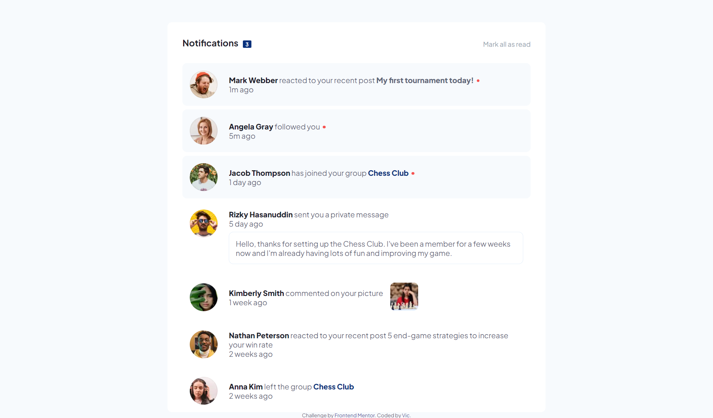
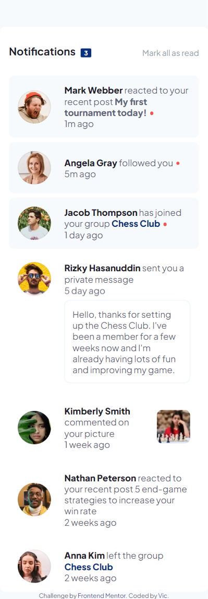

# Frontend Mentor - Notifications page solution

This is a solution to the [Notifications page challenge on Frontend Mentor](https://www.frontendmentor.io/challenges/notifications-page-DqK5QAmKbC). Frontend Mentor challenges help you improve your coding skills by building realistic projects. 

## Table of contents

- [Overview](#overview)
  - [The challenge](#the-challenge)
  - [Screenshot](#screenshot)
  - [Links](#links)
- [My process](#my-process)
  - [Built with](#built-with)
  - [What I learned](#what-i-learned)

## Overview

### The challenge

Users should be able to:

- Distinguish between "unread" and "read" notifications
- Select "Mark all as read" to toggle the visual state of the unread notifications and set the number of unread messages to zero
- View the optimal layout for the interface depending on their device's screen size
- See hover and focus states for all interactive elements on the page

### Screenshot





### Links

- Solution URL: [Add solution URL here](https://your-solution-url.com)
- Live Site URL: [Add live site URL here](https://your-live-site-url.com)

## My process

### Built with

- Semantic HTML5 markup
- CSS custom properties
- Flexbox
- JS


### What I learned
Being used to linking fonts with cdn in my html, I tried importing a downloaded font and import into CSS. Not new to me, but haven't used that in a while, had to google and check on W3Schools on how to achieve that.


```css
@font-face {
  font-family: pjSans;
  src: url(./assets/fonts/PlusJakartaSans-VariableFont_wght.ttf);
}
```

How to remove class from a list of elements more than one
```js
  const unreadIcon = document.querySelectorAll('span.udot_icon'); // to select all query 
  
  // Removes the 'udot_icon' class from all query found
        unreadIcon.forEach(function(icon) {
      icon.classList.remove('udot_icon');
        })
```